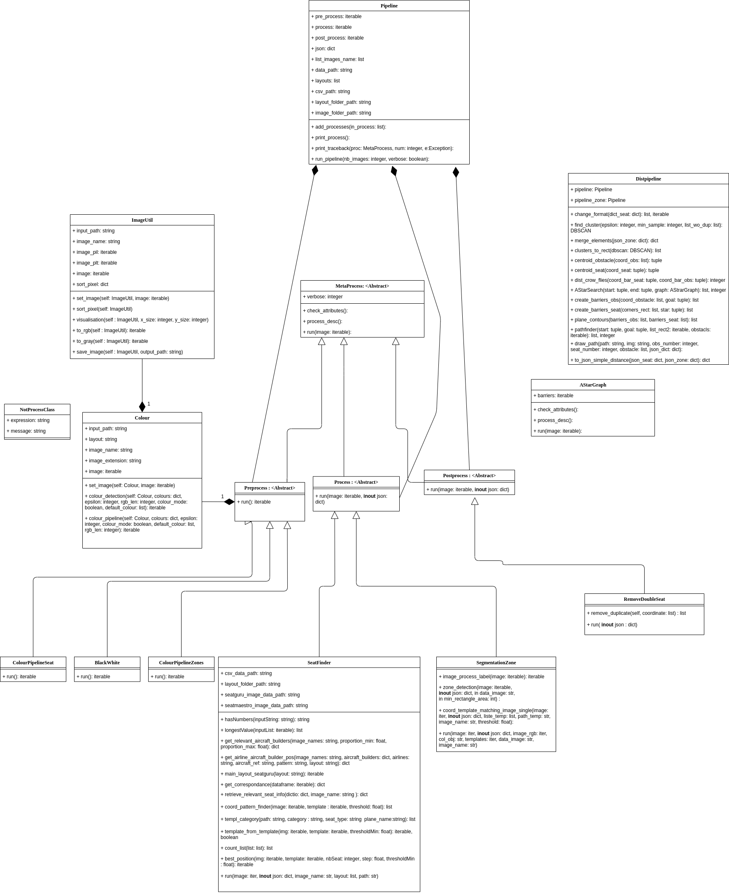
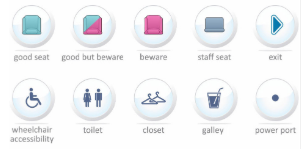

# ProjetInterpromo2020G8
Groupe 8 private repository : prediction cabines
# Environnement :
This project is a python project made with Python >= 3.6. All libraries requirements are described in "requirements.txt".

Install environnement with : pip install -r requirements.txt

# Software architecture : 

Look at "Exemple_notebook.ipynb" for a running exemple. 
# How to make process : 
How to run the solution (with minimum parameters):
 - pipeline = Pipeline(data_path)
 - pipeline.add_processes([list_of_processes])

Pipeline out is a dictionary (in a json format) :
 - print(pipeline.json)

Output format is :
 - Seat json output : { "image.png" : { "seat_type" : [ (x1,y1,h1,w1), (x2,y2,h2,w2),...] } 
 - Element json output : { "image.png" : { "element_type" : [(x1,y1,h1,w1), (x2,y2,h2,w2),...] } }

This contains multiple image in same dictionnary. 
##### Each detection is defined by its up right left corner point coordinates, height and width in the document.. 

Exemple_notebook.ipynb is an exemple the solution running over multiple images. Visualisation and statistics are plot in.

Be careful, data has to follow the archive architecture as : "Interpromo2020/All data/ANALYSE IMAGE/". In the "ANALYSE IMAGE" folder, there are folder for each type of layouts.
# How to run distances computation : 

To compute distances, another pipeline is defined : DistPipeline :
 - dist_pipeline = Distpipeline(pipeline_seat, pipeline_zone)
 - new_json = dist_pipeline.to_json_simple_distance(dist_pipeline.pipeline.json, dist_pipeline.pipeline_zone.json)

The new json format is : {"image.png" : {"type_seat" : { (x_seat,y_seat,h,w) : { "type_elem": { (x_elem, y_elem, h, w) : distance,... } }
}  }  }

It contains for each image, for each seat, for each element the distance of the seat to the element.
##### Each point is defined in this document by its centroid coordinates, height and width.

# Possible improvement : 
We have choosen to work only on 1 type of layout : Layout from SeatGuru that are in .png format.

To improve the solution, some things are possibles : 
 - Adapt the pipeline to other format (image reading problem for some pattern due to OpenCV) : it is required to adapt colors and pattern to other layouts and for the SeatMaestro graphical chart (A part have been done during the project but not used)
 - Pattern auto extraction from layouts : with pipeline for element detection, it is possible to extract some new pattern (i.e. elements zones, colored seats, etc...). The solution for an automatic labelisation can be done with CNN (Convolutionnal Neural Network) trained of a set of templates
 - Fast / Faster-RCNN : Make detection of every elements (seats, toilets, galley, etc..) we want and getting the bounding box of each element in 1 step. (A dataset with seats and element position is available (scrap from SeatGuru) with SVG image to make training on it). As data are really clean and objet to detect are clearly defined, it could work well and could learn easily.
 - Unet : neural network to make image segmentation recognizing seat and elements 

Neural network in our context are pretty much one of the best solution to answer to the needs. But a lack of data made us impossible to use thoses algorithms in the time we had.

#

Documentation Deep Learning : https://docs.google.com/document/d/1Pht0gxAkobEJzD24B42Fu_TzKjeq6rgOsKi-l9-fEvM/edit?usp=sharing

## Les branches sont nommés par prénom (ex : branche "Vincent-Nam"). Pour changer de branche il faut utiliser la commande "git checkout" suivi du nom de la branche (ex : git checkout Vincent-Nam)
##Pour visualiser la liste des branches : git branch -v 
Lien du document drive décrivant un peu le projet : https://docs.google.com/document/d/1bfkXWvkYrwYwVtkSgcScX5hb6XGzKLVn_2sqA2HXyDo/edit?usp=sharing
# Légende des plans : 
## Légende SeatGuru

## Légende SeatMaestro

###  TODO : 
#### - Pré-traitement des données :

- [x]  Explorations des données
    - [x] Récupération des éléments constituants des plans 
- [x]  Recherche d'éventuelles tendances pour simplifier les traitements
    - [x] Stat descriptives tailles images
- [x]  Traitement des images pour faire ressortir les informations voulues  
    - [ ] Normalisation des images pour les mettre à la même échelle
    - [x] Transformation couleurs 
#### - Traitement de la donnée :
- [x]  Choix des modèles de données : 
    - [x] Sortie de process
    - [x] Sortie de post-process 
- [x]  Formalisation des modèles de données 
    - [x] Sortie de process
    - [x] Sortie de post process 
- [x]  Localisation des sièges
    - [x] Pattern matching pour les sièges de SeatGuru
    - [ ] Pattern matching pour les sièges de SeatMaestro
- [x]  Localisation des autres éléments constituants des plans
    - [x] Pattern matching (NON) -> Segmentation pour les éléments de SeatGuru
    - [ ] Pattern matching pour les éléments de SeatMaestro
- [x]  Validation des résultats 

#### - Post-traitement des informations : 
- [x]  Valorisation des résultats
- [x]  Correction des prédictions 
    - [x] Alignement 
    - [x] Clustering
- [x]  Mise en forme des résultats  
- [x]  Distance des sièges par rapport aux autres éléments
    - [ ] Transformation des plans sous forme de grille 

 
###### Si du temps est disponible : 
- [ ]   Réseaux de neuronnes pour détections des éléments pour s'adapter à tout type de plans
- [x]   Heatmap -> Donné au groupe Dashboard
- [ ]  Mise en place d'une solution de visualisation dynamique 
- [ ]  ... ?

# Responsable de groupe : 
Il y aura pour chaque groupe un responsable de M2 référent à qui vous pourrez poser des questions sur votre groupe de travail.

- Groupe pré-processing :  William AZZOUZA
    -  Chloé GAUSSAIL
    -  Sonia BEZOMBES
    -  Sofiane BENHAMOUCHE
- Groupe traitement de l'information :  Vincent-Nam DANG
    - Célya MARCELO
    - Théo VEDIS

- Groupe post-processing :   Charlotte MARQUE
    -  Hassan HADDA 
    -  Jason DAURAT

# Organisation : 
Chaque personne possèdera son propre fichier pour travailler. Il ne faut modifier QUE son propre fichier. 
Pour pouvoir travailler, il est nécessaire d'avoir le fichier "pipeline.py" dans le même dossier que le notebook de travail.
Pour s'assurer d'avoir tous les outils nécessaire, je vous invite à cloner le repo en entier : 
   - Par ligne de commande : git clone https://github.com/vincentnam/ProjetInterpromo2020G8.git
   - Par interface graphique : cloner l'adresse https://github.com/vincentnam/ProjetInterpromo2020G8.git

### NE PAS TOUCHER AUX AUTRE FICHIERS 

## Les outils : 

-   Numpy
-   Pandas
-  OpenCV
-  PyTesseract
-  Github
-  JupyterNotebook 

## Charte qualité : 
Il y a une charte qualité à respecter ; elle reprend majoritairement la norme PEP 8 qui correspond aux normes standards de codage en python très très largement utilisée.

Prenez connaissance de la charte qualité avant de démarrer : https://docs.google.com/document/d/1csUL98Ustjmez9nq883nWNoeKvgMd04E/edit?fbclid=IwAR2caTMxbELjxZBReI51BFZZoRYK5KUTiuRFB8oCkuL_k3729oV6e-gLYAY#heading=h.l64629opzvrn